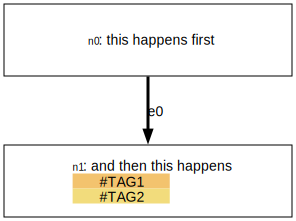

# Microdot - a REPL and terminal ui for dot and graphviz

The [Dot](https://graphviz.org/doc/info/lang.html) language is a great DSL for describing graphs, and it works fine  until you get to about ten nodes. Beyond that things get tricky: since you write node names and edges using long human names, things like a rename can get really annoyingly complex, with lots of find/replace over a file that's just too noisy.

Here's a graph;


And you can see the dot file used to generate it -

[fellowship.dot](./examples/fellowship.dot)

You'll notice that it's quite noisy; doing things like renaming nodes can be tricky; writing it yourself is a full-on programming experience. Once the graph gets to more than about 10 nodes, it can really start to drag. 

Now, an interactive editor for dot, which did live updates, would be pretty cool -- but I've never found one that really did what I wanted. 

Plus, who doesn't like a good unix-style command line tool?

Enter microdot. A repl-driven system for building graphs. The idea is to use language like so;

```
$ microdot my-graph.dot
>> i a cool new node
(inserted node n0: 'a cool new node')
>> i a second node
(inserted node n1: 'a second node')
>> l n0 n1
(Added edge e0 from n0 to n1)
>> r n1 a new name
(Node n1 renamed to 'a new name')
>> exit
```

This REPL-style app makes editing a large graph easy and interactive. It outputs `dot`, and compiles it to `svg` if you have graphviz installed and on your path. Importantly it defaults to a 'draft mode' output so you can see those node IDs;



In draft mode, the IDs of nodes and edges are included. This means we render a version where every node and edge can be referred to by a very short ID, like `n34` or `e16`. This makes it really easy to do things like delete an edge that shouldn't exist, rename a node, or insert a new node onto an edge. The operations that are hard when manually writing dot files.

Once complete, you can render the real artefact; with the right names, for presenting to people. And it's just a switch between, delivered as, say

```
> int
(interactive mode)
> disp
(display mode)
```


--

Color Palettes:

- go to http://khroma.co/train/
- train it with the 50-color selection
- on the trained page, pick a bunch of favourites - as many as you want for different node types
- download trained data (settings cog, download Kharma data button, get json file)
- copy it into src/my_khroma_data.json