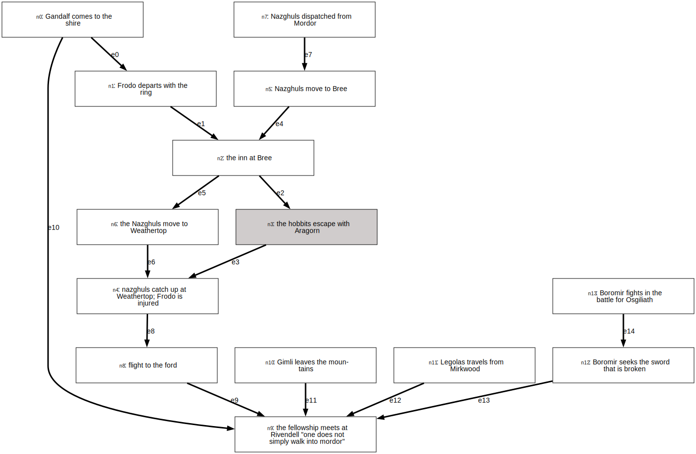
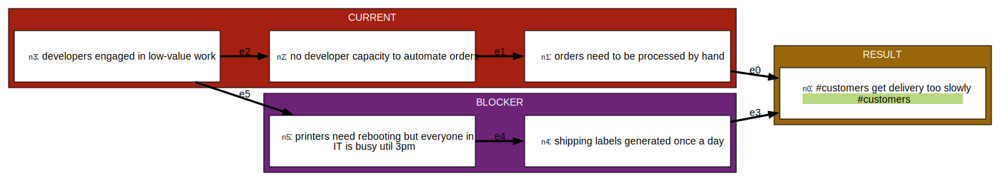

# Microdot - a REPL and terminal ui for dot and graphviz

A surprisingly useful kind of diagram is the dependency diagram - it shows how one thing leads to or causes another. For example, it could be part of a story, showing how one event lays the groundwork for the next;



It might also be useful for business analysis, where we examine how problems in a business are inter-related;



This kind of diagram is really useful, but tooling to help you make it is pretty hard to come by. Especially if you're not a programer.

There is a tool called graphviz, which makes these diagrams, which use the [Dot](https://graphviz.org/doc/info/lang.html) language to create these kinds of diagram. It's a system that is widely supported, but frankly becomes really hard to manage once you get above about ten nodes. Beyond that things get tricky: since you write node names and edges using long human names, things like a rename can get really annoyingly complex, with lots of find/replace over a file that's just too noisy.

I've written `microdot` to make this simpler and more interactive. It's a command-line tool you can start to build up the graph node by node, and edge by edge.

For the story example;

```
$ microdot --file story.json
>> i Gandalf comes to the shire
(inserted node n0: 'Gandalf comes to the shire')
>> aft n0 Frodo departs with the ring
(inserted node n1: 'Frodo departs with the ring' after n0)
>> aft n1 the inn at Bree
(inserted node n2: 'the inn at Bree' after n1)
>> aft n2 the hobbits escape with Aragorn
(inserted node n3: 'the hobbits escape with Aragorn' after n2)
>> aft n3 nazghuls catch up at Weathertop; Frodo is injured
(inserted node n4: 'nazghuls catch up at Weathertop; Frodo is injured' after n3)
>> i Nazghuls move to Bree
(inserted node n5: 'Nazghuls move to Bree')
>> l n5 n2
(Added edge e4 from n5 to n2)
>> aft n2 the Nazghuls move to Weathertop
(inserted node n6: 'the Nazghuls move to Weathertop' after n2)
>> l n6 n4
(Added edge e6 from n6 to n4)
>> bef n5 Nazghuls dispatched from Mordor
(inserted node n7: 'Nazghuls dispatched from Mordor' before n5)
>> aft n4 flight to the ford
(inserted node n8: 'flight to the ford' after n4)
>> aft n8 the fellowship meets at Rivendell "one does not simply walk into mordor"
(inserted node n9: 'the fellowship meets at Rivendell "one does not simply walk into mordor"' after n8)
>> l n0 n9
(Added edge e10 from n0 to n9)
>> bef n9 Gimli leaves the mountains
(inserted node n10: 'Gimli leaves the mountains' before n9)
>> bef n9 Legolas travels from Mirkwood
(inserted node n11: 'Legolas travels from Mirkwood' before n9)
>> bef n9 Boromir seeks the sword that is broken
(inserted node n12: 'Boromir seeks the sword that is broken' before n9)
>> bef n12 Boromir fights in the battle for Osgiliath
(inserted node n13: 'Boromir fights in the battle for Osgiliath' before n12)
>> /hobbits
(Search results for: hobbits,
n3: the hobbits escape with Aragorn
)
CTRL-D

```

For the business example;

```
$ microdot --file story.json
>> lr
(Direction changed to LR)
>> i customers get delivery too slowly
(inserted node n0: 'customers get delivery too slowly')
>> bef n0 orders need to be processed by hand
(inserted node n1: 'orders need to be processed by hand' before n0)
>> bef n1 no developer capacity to automate orders
(inserted node n2: 'no developer capacity to automate orders' before n1)
>> bef n2 developers engaged in low-value work
(inserted node n3: 'developers engaged in low-value work' before n2)
>> bef n0 shipping labels generated once a day
(inserted node n4: 'shipping labels generated once a day' before n0)
>> bef n4 printers need rebooting but everyone in IT is busy util 3pm
(inserted node n5: 'printers need rebooting but everyone in IT is busy util 3pm' before n4)
>> l n3 n5
(Added edge e5 from n3 to n5)
CTRL-D

```

See how we're working one line at a time, inserting nodes and linking them together? Each time you make a change, the diagram is regenerated on disk as an SVG file. SVGs can be opened in a browser, making a cheap and cheerful viewer, or you can use a tool like [Gapplin](http://gapplin.wolfrosch.com/) to automatically refresh the SVG as it changes.

This approach can be pretty good for workshops or interactive sessions, where you act as a moderator, and people can call out intructions, like "I think we need to link n3 to n8," and you can add them. Maybe someday I'll make something cooperative, but not today :)

---

Enter microdot. A repl-driven system for building graphs. The idea is to use language like so;

```
$ microdot --file my-graph.json
>> i this happens first
(inserted node n0: 'this happens first')
>> i and then this happens
(inserted node n1: 'and then this happens')
>> l n0 n1
(Added edge e0 from n0 to n1)
>> r n1 and then this happens #TAG1 #TAG2
(Node n1 renamed to 'and then this happens #TAG1 #TAG2')
CTRL-D

```

This REPL-style app makes editing a large graph easy and interactive. It outputs `dot`, and compiles it to `svg` if you have graphviz installed and on your path. Importantly it defaults to a 'draft mode' output so you can see those node IDs;


In draft mode, the IDs of nodes and edges are included. This means we render a version where every node and edge can be referred to by a very short ID, like `n34` or `e16`. This makes it really easy to do things like delete an edge that shouldn't exist, rename a node, or insert a new node onto an edge. The operations that are hard when manually writing dot files.

Once complete, you can render the real artefact; with the right names, for presenting to people. And it's just a switch between, delivered as, say

```
> int
(interactive mode)
> disp
(display mode)
```


--

Color Palettes:

- go to http://khroma.co/train/
- train it with the 50-color selection
- on the trained page, pick a bunch of favourites - as many as you want for different node types
- download trained data (settings cog, download Kharma data button, get json file)
- copy it into src/my_khroma_data.json

https://applecolors.com/palettes

#ED4145 #F1B02F #EADE84 #A3D064 #11B2AA #177C99


# Run in Docker

````
docker build . --tag microdot:latest
docker run --rm --mount type=bind,source="$(pwd)"/examples,target=/examples -it microdot:latest microdot --file /examples/story.json
````
