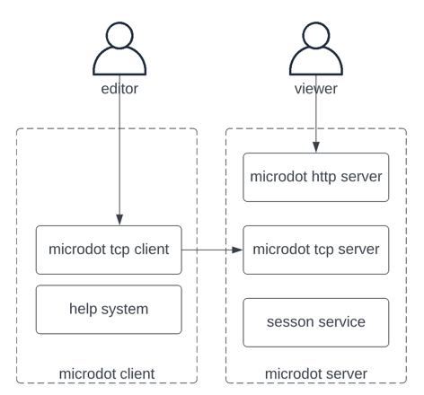

The app has grown to be a bit coupled; given the desire to do things like make it networked, add other heads, etc, it makes sense to refactor it into harder, more discrete modules.

- graph representation; the in-memory representation of the graph, along with an ability to update it, and validation rules for what constitutes a valid update. In `microdot-core`.
- graph layout; currently done by graphviz, but again, not necessary at all. Might look to using kroki, which would let me deal just producing dot, and letting kroki deal with producing the SVG.
- graph display; graphviz can represent graphs in many ways; node color, fornt, interface, etc. Right now that's bound up in a single `graphviz` module that is both visual display and layout algorithm and disk output mechanism; it would be nice to have pluggable display options. A `NodeFormatter` to go with `Exporter`, perhaps?
- graph storage; loading and saving data from some store. Curently we save json to disk, but that could be varied. Eg, we could GET and POST json to a web server, or stream it to and from a network socket. A more generic buffer-based solution could work nicely.
- graph output; again, currently written to disk as SVG and PNG files, but those don't need to be delivered as files, they could be delivered as HTTP responses by a web server or something
- parser and repl; the USP of this is being able to type and issue commands via a terminal app; but this can be seen as building on top of and coordinating the other parts of the system. (currently Graph consumes GraphCommand, but nothing consumes Command, suggesting we have something like 'Session' that could take SessionCommand, and then you would have the state of the server in the session.

Q's
==

As the session updates, the graph updates; right now I create the file on disk, and use Gapplin to reload. A browser-based tool means no extra tooling, and we could do things like use ngrok to allow anyone to see it being edited live.

A websockets-based web server would be a good idea, perhaps. That'd be part of making the whole thing into a networked version.

Networking-up would go something like;

- start a tcp server for holding all state
- start a tcp client for updating and REPL
- now we've got a split and can write two separate binaries
- add an html front-end to the TCP server so we can display SVG, do auto-reload, etc.

